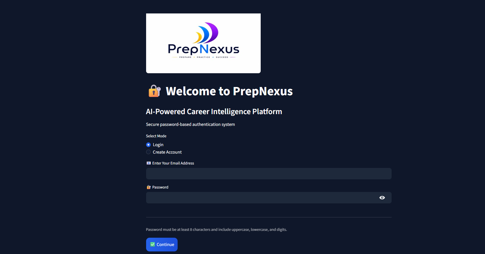
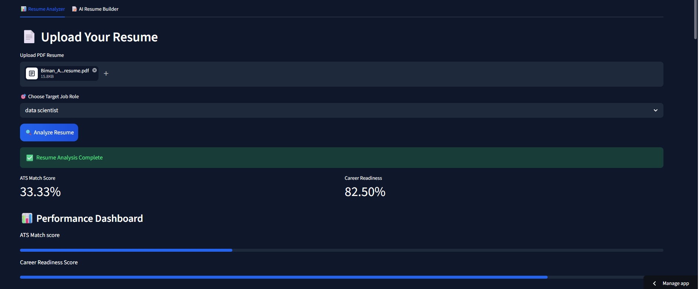
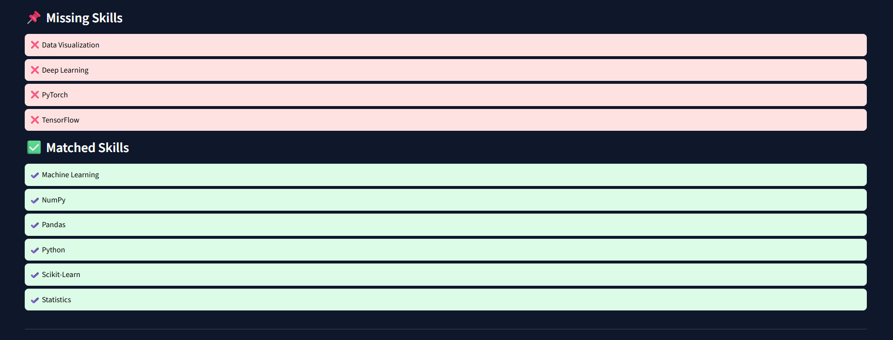
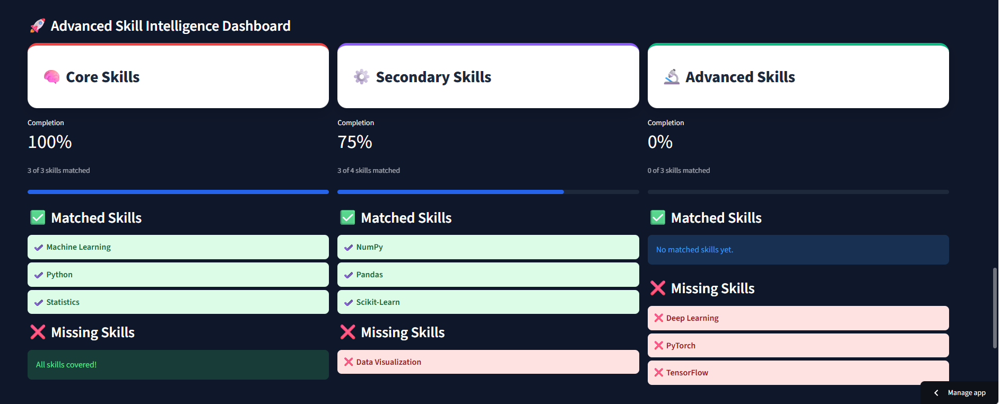
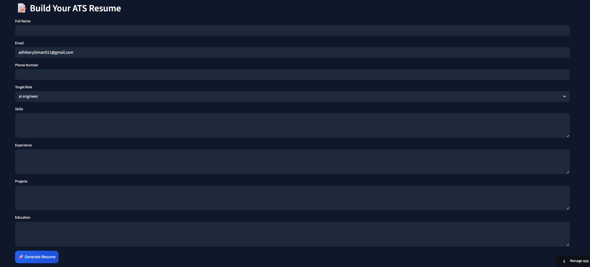

# 🚀 PrepNexus

> **AI-Powered Career Intelligence Platform**
> Transforming resume analysis, ATS optimization, skill-gap detection, and interview preparation into one unified ecosystem.

---

# 🌟 Overview

**PrepNexus** is an advanced AI-driven career development platform designed to help students, job seekers, and professionals:

* 📄 Analyze resumes against target roles
* 🎯 Detect skill gaps using role-specific intelligence
* 🧠 Measure ATS compatibility and career readiness
* 📝 Generate ATS-optimized resumes using Gemini AI
* 📚 Build stronger career roadmaps through data-backed recommendations
* 🔐 Secure user authentication and personalized resume management

PrepNexus is built to evolve beyond resume intelligence into a **full gamified interview preparation ecosystem**.

---

# 🔥 Core Features

## 📊 AI Resume Analyzer

* Upload PDF resumes
* Extract resume content automatically
* Perform:

  * ATS Match Score analysis
  * Career Readiness Score
  * Skill gap detection
  * Core / Secondary / Advanced skill classification
* Compare resume with real-world job role requirements
* Personalized recommendations for career improvement

---

## 📝 AI Resume Builder

* Gemini-powered ATS resume generation
* Structured professional resume formatting
* Role-specific keyword optimization
* Downloadable PDF export
* Resume storage for user history

---

## 🔐 Secure Authentication System

* User registration/login
* Password hashing
* Persistent user database
* Personalized dashboard experience

---

## 🎯 Career Intelligence Dashboard

* Required skills visualization
* Missing skills tracking
* Readiness metrics
* Advanced skill segmentation
* Recruiter-style dashboard interface

---

## 🚀 AI Skill Recommendation & Learning Resource Engine
* Automatically analyzes missing skills after resume evaluation
* Generates compact AI-powered learning recommendations
* Provides short actionable improvement steps
* Recommends practical projects based on missing skills
* Suggests important technologies/frameworks to learn
* Displays recommendations after:
* Core Skills
* Secondary Skills
* Advanced Skills
* Recommends best YouTube videos and playlists for missing skills
* Suggests curated online courses for skill improvement
* Generates personalized learning roadmaps for target roles
* Provides role-specific learning guidance from beginner to advanced
* Optimized compact response generation for faster performance
* Gemini-powered personalized career guidance
* Lightweight recommendation architecture for low response time
---

## 🤖 AI Career Roadmap Chatbot

* Interactive AI-powered career guidance assistant
* Provides personalized career roadmaps based on user goals
* Suggests role-specific skills, tools, and technologies
* Answers career, resume, and skill-related queries
* Recommends learning resources, courses, and YouTube tutorials
* Generates beginner-to-advanced learning paths
* Helps users identify missing skills for target roles
* Provides compact and actionable career recommendations
* Gemini-powered intelligent conversational support
* Designed for real-time career assistance and roadmap planning


# 📸 Platform Demo

## 🔐 Secure Authentication Interface


---

## 📄 Resume Analyzer Dashboard


---

## 📌 Skill Gap Detection System


---

## 🚀 Advanced Skill Intelligence Dashboard


---

## 📝 AI ATS Resume Builder



-----

# 🛠️ Tech Stack

## Frontend

* **Streamlit**
* Custom CSS
* Responsive dashboard UI

## Backend

* **Python 3.11**
* FAISS Vector Search
* LangChain
* Sentence Transformers
* NLTK
* PyPDF2
* ReportLab PDF generation

## AI / ML

* Google Gemini API
* HuggingFace Embeddings
* Resume-role semantic matching
* Skill normalization engine

## Database

* MySQL / relational storage
* User management
* Resume history

## Deployment

* Streamlit Community Cloud
* GitHub CI/CD workflow

---

# ⚙️ Working Architecture

## 🔄 End-to-End Workflow

```txt
User Login / Signup
        ↓
Secure Authentication
        ↓
Dashboard Access
        ↓
--------------------------------------------------
|                CORE MODULES                     |
--------------------------------------------------
| Resume Analyzer                                 |
| - PDF Upload                                    |
| - PDF Parsing                                   |
| - Text Cleaning                                 |
| - Skill Extraction                              |
| - FAISS Role Matching                           |
| - ATS Score                                     |
| - Readiness Score                               |
| - Missing Skills Detection                      |
| - Dashboard Visualization                       |
--------------------------------------------------
| ATS Resume Builder                              |
| - User Career Inputs                            |
| - Gemini AI Resume Generation                   |
| - ATS Optimization                              |
| - PDF Export                                    |
--------------------------------------------------
        ↓
User Receives:
- Resume Intelligence
- Skill Gap Analysis
- Career Recommendations
- ATS Resume PDF


# 📂 Project Structure

```bash
PrepNexus/
│
├── app.py
├── requirements.txt
├── runtime.txt
├── .streamlit/
│   └── config.toml
│
├── assets/
│   ├── logo.png
│   └── icon.png
│
├── data/
│   ├── all_skills.py
│   ├── job_roles.py
│   └── role_weights.py
│
├── database/
│   ├── init_db.py
│   └── crud.py
│
├── rag/
│   ├── embedder.py
│   ├── retriever.py
│   ├── vector_store.py
│   └── job_index/
│
├── utils/
│   ├── pdf_parser.py
│   ├── text_cleaner.py
│   ├── skill_extractor.py
│   ├── readiness_scorer.py
│   ├── resume_api_builder.py
│   └── pdf_exporter.py
│
└── generated_resumes/
```

---

# ⚙️ Installation Guide

## 1️⃣ Clone Repository

```bash
git clone https://github.com/biman2006/prepnexus.git
cd prepnexus
```

## 2️⃣ Create Virtual Environment

```bash
python -m venv venv
source venv/bin/activate   # Linux/Mac
venv\Scripts\activate      # Windows
```

## 3️⃣ Install Dependencies

```bash
pip install -r requirements.txt
```

## 4️⃣ Configure Environment Variables

Create `.env`:

```env
GEMINI_API_KEY=your_key
EMAIL_USER=your_email
EMAIL_PASS=your_password
DB_HOST=your_host
DB_USER=your_user
DB_PASSWORD=your_password
DB_NAME=your_db
```

---

# ▶️ Run Locally

```bash
streamlit run app.py
```

---

# ☁️ Deployment

## Streamlit Community Cloud

* Connect GitHub repository
* Add secrets securely
* Deploy `app.py`

---

# 🧩 Future Roadmap

## 🎮 Gamified Interview Preparation System

Planned next-generation modules include:

### 🕹️ Interview Battle Arena

* Mock interview simulations
* Timed challenges
* XP points system
* Leaderboards
* Skill progression levels
* Daily/weekly missions

### 🤖 AI Interview Coach

* HR + Technical mock interviews
* Real-time answer scoring
* Voice analysis
* Communication scoring
* Behavioral feedback

### 🏆 Competitive Career Progression

* Badge unlock systems
* Resume power levels
* Recruiter simulation rankings
* Company-specific preparation tracks

### 📚 Learning Ecosystem

* Personalized upskilling paths
* Dynamic project recommendations
* Course integrations
* Certification tracking

### 🌐 SaaS Expansion Goals

* Admin dashboard
* Subscription tiers
* Recruiter access panels
* Enterprise hiring intelligence
* College placement partnerships

---

# 📈 Long-Term Vision

PrepNexus aims to become:

## **“The Duolingo + LinkedIn + LeetCode of Career Development”**

A unified platform where users can:

* Build
* Analyze
* Learn
* Practice
* Compete
* Get hired

---

# 🤝 Contribution Guidelines

Contributions are welcome.

## Areas:

* UI/UX improvements
* Performance optimization
* New job role intelligence
* Gamification modules
* AI interview systems
* Security enhancements

---

# 🔒 Security Notes

* Environment secrets protected
* Password hashing enabled
* Sensitive files excluded via `.gitignore`
* Secure deployment practices followed

---

# 📜 License

This project is licensed under the **MIT License**.

---

# 👨‍💻 Author

**Biman Adhikary**
Founder of PrepNexus

---

# ⭐ Final Mission

> **PrepNexus is not just a resume tool.**
> It is evolving into a complete AI-powered career transformation ecosystem.

---

## 🚀 Build Skills. Beat Competition. Get Hired.
